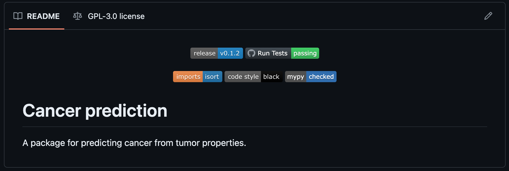

The final stage is to publish the documentation.

Here is the workflow for this:
```yaml
name: documentation
on:
  push:
    tags:
      - 'v*'

jobs:
  build-docs:
    needs: tests
    if: github.event_name == 'push' && github.ref == 'refs/heads/main'
    runs-on: ubuntu-latest

    steps:
      - uses: actions/checkout@v4
        with:
          fetch-depth: 0

      - name: Verify tag is on main
        run: |
          # Get the branch containing this tag
          BRANCH=$(git branch -r --contains ${{ github.ref }} | grep 'main' || true)
          
          # Check if the tag is on main
          if [ -z "$BRANCH" ]; then
            echo "Error: Tag must be created on main branch"
            exit 1
          fi

      - name: Install Poetry
        run: pipx install poetry

      - uses: actions/setup-python@v5
        with:
          python-version: '3.12'
          cache: 'poetry'

      - name: Install dependencies with dev group
        run: poetry install --with dev

      # Deploy docs
      - name: Deploy documentation
        run: |
          poetry run mkdocs gh-deploy --force
```

Most of this is the same as for publishing the package to PyPi. The main difference is that we are running `mkdocs gh-deploy --force` to deploy the documentation to GitHub Pages. This will create a new branch called `gh-pages` which will contain the documentation.

You should now be able to navigate to `https://<username>.github.io/<repo-name>` and see your documentation!

!!! tip

    This is a great tool to make personal websites for your work. You can add images, links, and even videos to your documentation. It is a great way to showcase your research.

    This website was made using MkDocs and the Material theme! Check out the Material website [here](https://squidfunk.github.io/mkdocs-material/).

    For more details on how our websites are made, then you can browse through the folders in the github repo by clicking the GitHub icon at the top left of the page.

In addition, since we are using some tools, we should let everyone know! So we can add the following to our `README.md` file (just be sure to replace the links with the correct ones):
```html
<div align="center">

  <a href="">[](https://GitHub.com/rkdan/cancer-prediction/releases)</a>
  <a href=""></a>

</div>

<div align="center">

  <a href="">[](https://pycqa.github.io/isort/)</a>
  <a href="">[](https://github.com/psf/black)</a>
  <a href="">[](https://mypy-lang.org/)</a>
</div>
```

which should display as the following:


Before we push these changes, we will configure GitHub Pages so that our documentation will create a url for people to visit. Go to the repo Settings -> Pages, and pick a branch to deploy from, in this case 'gh-pages'. So now when we push these changes and merge them to `main`, the documentation will be published and the badges will be displayed on the README!

!!! tip

    You can in principle delete the 'dev' branch whenever you build your package. But if for whatever reason you decide to keep it, be sure to do the following
    ```bash
    git checkout dev
    git fetch origin
    git merge origin/main
    ```

    This will ensure that the 'dev' branch is up to date with the 'main' branch. Do this BEFORE you make any changes to the 'dev' branch, otherwise you have to merge the changes manually.