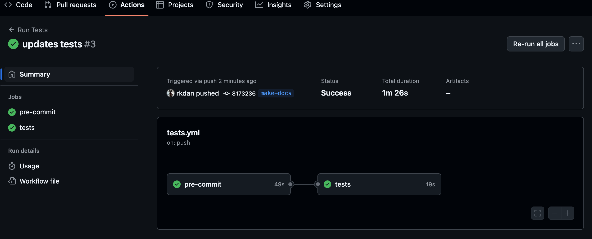

The process of automated testing is a little more involved, and we now introduce GitHub Actions.

## The testing workflow
Create a new directory
```bash
mkdir -p .github/workflows # (1)!
```

1. The `-p` flag creates the entire directory structure if it does not exist.


and add a file in this directory called `tests.yml`. Now add the following

```yaml linenums="1"
name: Run Tests

on:
  push:
    branches-ignore:
      - main

jobs:
  pre-commit:
    runs-on: ubuntu-latest

    steps:
    - uses: actions/checkout@v4
    - name: Install poetry
      run: pipx install poetry
    - uses: actions/setup-python@v5
      with:
        python-version: '3.12'
        cache: 'poetry'
    - run: poetry install
    - name: Run pre-commit checks
      run: |
        poetry run pre-commit run --all-files

  tests:
    needs: pre-commit
    runs-on: ubuntu-latest

    steps:
    - uses: actions/checkout@v4
    - name: Install poetry
      run: pipx install poetry
    - uses: actions/setup-python@v5
      with:
        python-version: '3.12'
        cache: 'poetry'
    - run: poetry install
    - name: Run tests
      run: |
        poetry run python -m unittest discover tests/
```

Let's walk through what we have done here.

### Choose when the workflow runs
```yaml linenums="1"
name: Run Tests

on:
  push:
    branches-ignore:
      - main
```

We give the workflow a name `Run Tests`. Then we say, whenever a push is made to any branch other than `main`, run this workflow.

### The jobs
Next, we define what `jobs` we want to run. In this case we have two: the `pre-commit`, and the `tests`.

#### The pre-commit checks
```yaml
pre-commit:
    runs-on: ubuntu-latest

    steps:
    - uses: actions/checkout@v4
    - name: Install poetry
        run: pipx install poetry
    - uses: actions/setup-python@v5
        with:
        python-version: '3.12'
        cache: 'poetry'
    - run: poetry install
    - name: Run pre-commit checks
        run: |
        poetry run pre-commit run --all-files
```

We choose what OS we want to run on, in this case the latest version of Ubuntu. Then we define what steps to take:

1. Install poetry with python version 3.10
2. Install the package with `poetry install`
3. Run the pre-commit on our files.

So this entire thing is the equivalent to us saying `poetry run pre-commit run --all-files` from before.

#### The test cases
```yaml
tests:
needs: pre-commit
runs-on: ubuntu-latest

steps:
- uses: actions/checkout@v4
- name: Install poetry
    run: pipx install poetry
- uses: actions/setup-python@v5
    with:
    python-version: '3.12'
    cache: 'poetry'
- run: poetry install
- name: Run tests
    run: |
    poetry run python -m unittest discover tests/
```

We have defined an extra field here `#!yaml needs: pre-commit`. This ensures that this part of the workflow __will not run unless the pre-commit checks all pass__. If there are problems with our code, what's the point of running the tests? Fix the issues first, then resubmit.

We then install poetry and python again, and run the unittests. So now, everytime we push changes to the `dev` branch, we will initilize this workflow!

!!! tip

    It is also possible to use multiple versions of python and even different operating systems using the `matrix` strategy:
    
    ```yaml
    jobs:
        example_matrix:
            strategy:
                matrix:
                os: [ubuntu-latest, macos-latest]
                version: [3.10, 3.11, 3.12]
            runs-on: ${{ matrix.os }}
            steps:
                - uses: actions/setup-python@v5
                with:
                    python-version: ${{ matrix.version }}

    ```

     The world of GitHub Actions workflows is complex and full of danger. My advice is to keep it simple.

<br>
{ width="50" .center }
<br>

Now that we have our tests set up, let's try pushing these changes to our remote. You can head over to the `Actions` tab on your GitHub repository to see the workflow in action.



## Further reading
<div class="grid cards" markdown>

-   :fontawesome-solid-book-open:{ .lg .middle } [__CI/CD - Testing resources__](../resources/references.md#cicd-testing)

    ---
    Information on GitHub Workflows

</div>