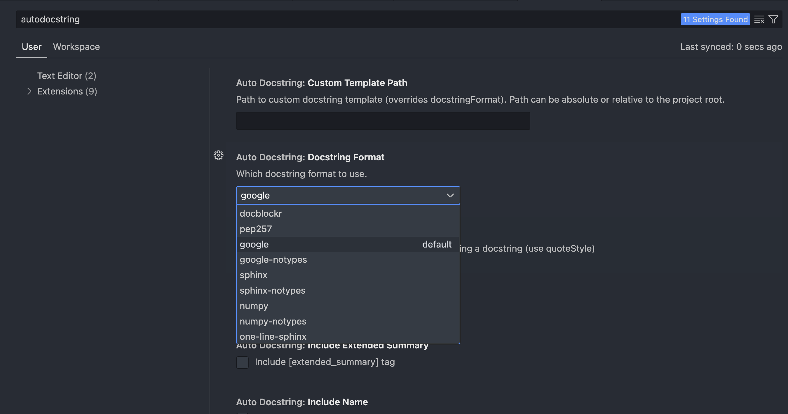
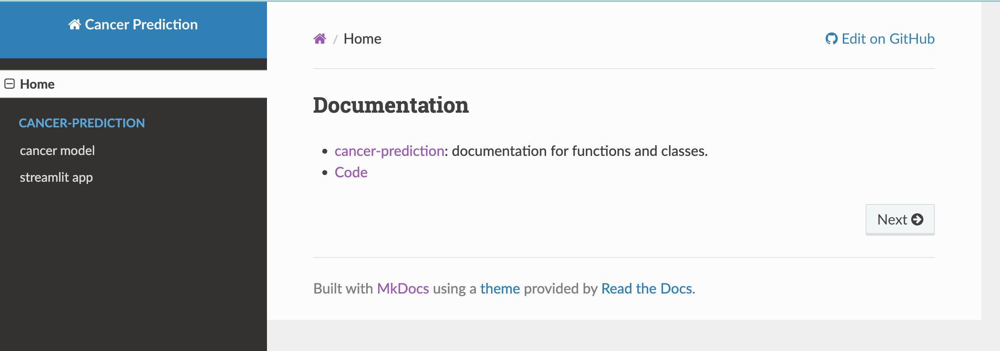

There are a few popular ways to publish documentation for your project. Here, we will use [MkDocs](https://www.mkdocs.org/), but another popular framework is [Read the Docs](https://about.readthedocs.com/?ref=readthedocs.com). MkDocs is highly customizable, has good support, and is used by many companies around the world. This site was created with [Material for MkDocs](https://squidfunk.github.io/mkdocs-material/).

## Documenting your code
The first step is appropriately documenting your code. In general, the code itself should try to follow the [PEP 8 Style Guide for Python Code](https://peps.python.org/pep-0008/). However, this extract from PEP 8 is useful to keep in the back of your mind:

!!! quote "A Foolish Consistency is the Hobgoblin of Little Minds"

    The guidelines provided here are intended to improve the readability of code and make it consistent across the wide spectrum of Python code. As PEP 20 says, “Readability counts”.

    A style guide is about consistency. Consistency with this style guide is important. Consistency within a project is more important. Consistency within one module or function is the most important.

    However, know when to be inconsistent – sometimes style guide recommendations just aren’t applicable. When in doubt, use your best judgment. Look at other examples and decide what looks best. And don’t hesitate to ask!

    In particular: do not break backwards compatibility just to comply with this PEP!

    Some other good reasons to ignore a particular guideline:

    1. When applying the guideline would make the code less readable, even for someone who is used to reading code that follows this PEP.
    
    2. To be consistent with surrounding code that also breaks it (maybe for historic reasons) – although this is also an opportunity to clean up someone else’s mess (in true XP style).
    
    3. Because the code in question predates the introduction of the guideline and there is no other reason to be modifying that code.
    
    4. When the code needs to remain compatible with older versions of Python that don’t support the feature recommended by the style guide.

Although our code should be high quality, there are some things that will greatly help with readability. Think about what happens when you hover your mouse over a function in VSCode:


We can see that hovering over the `make_symmetric()` method gives us some information - what arguments it takes, and what it should return. This information is captured by two things:

1. Type hints
2. Docstrings

### Type hints
We cover type hints first, because they will make adding docstrings easier. For inspiration on type hints, we can turn to [PEP 484](https://peps.python.org/pep-0484/). Type hints are exactly that: hints about what type an input or output should be. In the case of `make_symmetric()`, we can see that it takes two arguments `A` which is a numpy array, and `bin`, which is a boolean with a default value of `False`. We add type hints in the following way:

```python
def my_function(arg: type, optional_arg: type = default_value) -> type:
    # function logic
```
If your function doesn't return anything, then you can use `None`. A class `__init__` method should also return `None`. Check out PEP 484 for some acceptable types, but you can use custom types, or multiple types. Have a look through the scripts in our project to see some more examples.

!!! tip

    You should always try using type hints wherever possible

### Docstrings
Docstrings are the providence of [PEP 257](https://peps.python.org/pep-0257/). Looking at our example above we can see that the docstring part of this function is:

```python
"""
Take an adjacency matrix and make it symmetric.

Args:
    A (np.ndarray): Adjacency matrix of the network.
    bin (bool, optional): Is the network binary or not. Defaults to False.

Returns:
    np.ndarray: Symmetric adjacency matrix of the network.
"""
```

There are a few different templates for creating docstrings. The one used above is the Google template. Here are some common templates:

1. Google
```
"""
This is an example of Google style.

Args:
    param1 (type): Description of param1.
    param2 (type, optional): Description of param2. Defaults to value.

Returns:
    type: This function returns something.

Raises:
    KeyError: Raises a KeyError exception.
"""
```

2. Numpy
```
"""
This is an example of Numpy style.

Parameters
----------
param1 : type
    the 1st param name `first`
param2 : {'value', 'other'}, optional
    param, by default 'value'

Returns
-------
type
    a value in a string

Raises
------
KeyError
    when a key error happens
"""
```

3. reST
```
"""
This is an example of reST style.

:param type param1: this is a first param
:param type, optional param2: this is a second param, defaults to value
:returns type: this is a description of what is returned
:raises keyError: raises an exception
"""
```

All of these are acceptable, but Google and Numpy offer very human readable docstrings.

Since we have taken the time to use type hints, we can actually configure VSCode to automatically generate docstrings for us! First download the Auto Docstring extension. Go into Settings, and search for `Auto Docstring: Docstring Format`:



Probably this is Google by default. Now, go into your `streamlit_app.py` script and find the `train_and_save_model` function. We haven't added type hints yet, so lets do that.

<details>
<summary>Click to reveal the answer</summary>

```python
def train_and_save_model(train_data: pd.DataFrame, filename: str = 'cancer_model.pkl') -> CancerModel:
```
</details> 

Now all we need to do is press enter after the colon and typ `"""`. A prompt will appear called `Docstring Generation`. Hit `tab` and the following should appear

<details>
<summary>Click to reveal</summary>

```python
def train_and_save_model(train_data: pd.DataFrame, filename: str = 'cancer_model.pkl') -> CancerModel:
    """_summary_

    Args:
        train_data (pd.DataFrame): _description_
        filename (str, optional): _description_. Defaults to 'cancer_model.pkl'.

    Returns:
        CancerModel: _description_
    """
```
</details> 

It is now up to us to fill in summary and descriptions. If you have GitHub Copilot enabled, it will also try to autocomplete the type hints. Needless to say, this can save us quite a lot of time.

There are a few other functions and methods without type hints or docstrings, so feel free to complete them.

## Setting up MkDocs
Perhaps surprisingly, MkDocs can automatically parse your docstring information and produce documentation! We must first install mkdocs and mkdocstrings to the dev group (because users won't need these packages to run the code):
```
poetry add --group dev mkdocs mkdocstrings mkdocstrings[python]
```

We now run
```
python -m mkdocs new .
```

This will generate a `mkdocs.yml` file in your root directory, and a `docs` folder, which will contain a file named `index.md` with some default text. We will keep things simple for now, so in the `index.md` file, we just add:

```
## Documentation
Welcome to the documentation for the cancer prediction project. Here you will find information on the cancer model and the streamlit app.
```

Now we want to mimic the structure of our source file directory, so we create a new folder within `docs` called `cancer-prediction`, and within, we create two files: `cancer_model.md` and `streamlit_app.md`. So your documentation directory should be something like:

```
.
├─ docs/
│  ├─ cancer-prediction
│  │  ├─ cancer_model.md
│  │  └─ streamlit_app.md
│  └─ index.md
└─ mkdocs.yml
```

Within these two new files, we add:
```
::: cancer_prediction.cancer_model
```

and
```
::: cancer_prediction.streamlit_app
```

This tells MkDocs where to look for the docstring information. The final thing left is to complete the `mkdocs.yml` file. These can get quite complicated (just have a quick look at the `yml` for this branch of the repo), and full customization options is __well__ beyond the scope of this course. We will keep it simple:

```yaml
site_name: Cancer Prediction
site_url: https://github.com/<user-name>/cancer-prediction-<crsid>
repo_url: https://github.com/<user-name>/cancer-prediction-<crsid>
nav:
  - Home: index.md
  - cancer-prediction:
    - cancer model: cancer-prediction/cancer_model.md
    - streamlit app: cancer-prediction/streamlit_app.md
theme: readthedocs
plugins:
  - mkdocstrings
watch:
  - .  # reload docs for file changes
```

All that is left is to locally serve the documentation:
```
python -m mkdocs serve
```
This should open a page like this:


and if you click the "cancer model" tab on the sidebar, you should see something like this:


And that's about it.

<br>
{ width="50" .center }
<br>

## Further reading
<div class="grid cards" markdown>

-   :fontawesome-solid-book-open:{ .lg .middle } [__Documentation resources__](../resources/references.md#documentation)

    ---
    Information on PEP style guides, docstring conventions and type hints, as well as popular documentation frameworks

</div>
